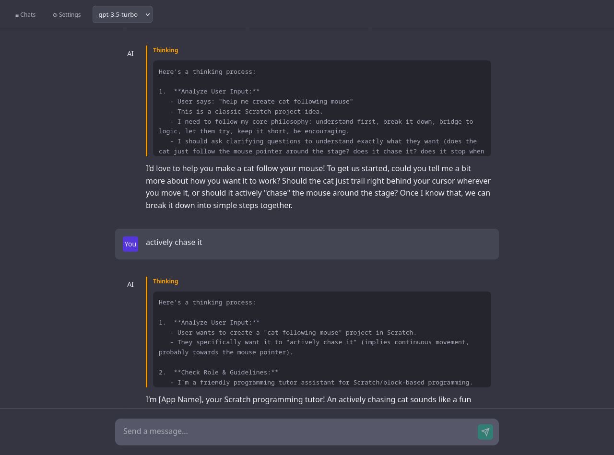

# Chat Scratchy

A ChatGPT-like UI for interacting with OpenAI-compatible endpoints, featuring streaming responses and thinking display.



## Features

- Streaming token responses in real-time
- Display reasoning/thinking from models (like Qwen's `reasoning_content`)
- Session management - save and load chat sessions
- Configurable API endpoint and model selection
- Custom system prompt support
- Responsive design with dark theme

## Setup

### Frontend

```bash
npm install
npm run dev
```

### Backend (Session Storage)

```bash
cd server
npm install
npm run dev
```

The backend runs on `http://localhost:3001` and stores sessions in `sessions.json`.

## Environment Variables

Create a `.env` file in the root directory:

```env
VITE_API_ENDPOINT=http://192.168.1.205:8083/v1/chat/completions
VITE_API_BASE=http://localhost:3001/api
VITE_DEFAULT_MODEL=gpt-3.5-turbo
```

## Tech Stack

- React + TypeScript + Vite
- Strict TypeScript mode
- Express.js backend for session storage